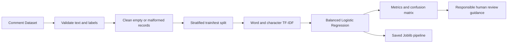
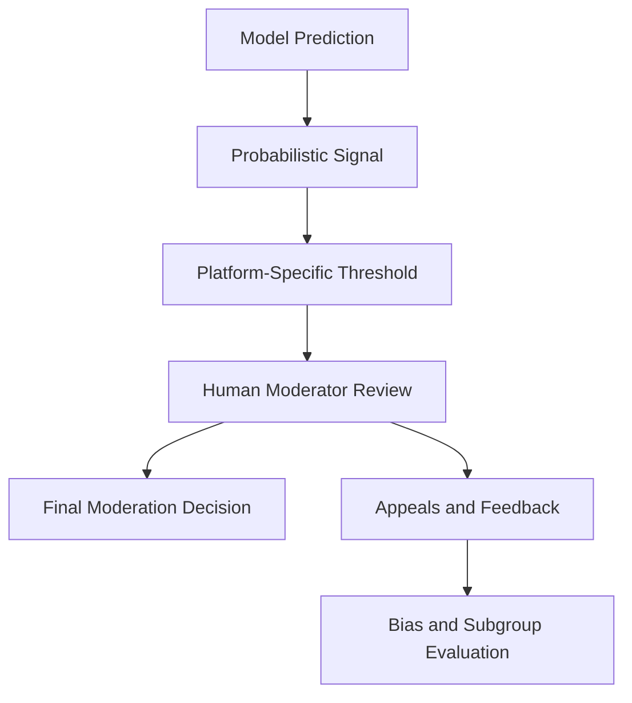

# Toxic Comment Classification System

[](https://www.python.org/)
[](https://github.com/MuhammadWahab7/Toxic-Comment-Classification-System/actions/workflows/quality.yml)
[](ETHICS.md)

A documented text-classification project for identifying toxic online comments.
The repository combines a reproducible TF-IDF baseline, the original Google
Colab ensemble notebook, historical experiment results, and responsible-use
guidance for content-moderation research.

> **Responsible-use statement:** Predictions are probabilistic screening signals,
> not final moderation decisions. Human review, an appeals process, subgroup
> evaluation, privacy controls, and deployment-specific threshold tuning remain
> necessary.

## Visual Overview




## Technology Stack

| Area | Technology |
| --- | --- |
| Language | Python 3.10+ |
| Machine Learning | scikit-learn, TF-IDF, Logistic Regression, ensemble notebooks |
| Data Handling | pandas, NumPy, CSV-based datasets |
| Model Artifacts | Joblib pipeline export and JSON metrics |
| Experiment Environment | Local CLI workflow and preserved Google Colab notebook |
| Quality | unittest, compile checks, GitHub Actions workflow |
| Documentation | Model card, ethics notes, dataset card, security guidance, citation metadata |
## Project Components

### Reproducible CLI baseline

The installable package provides a locally testable baseline:

- validates `comment_text` and binary `toxic` columns;
- removes empty comments and malformed labels;
- performs a stratified train/test split;
- trains word and character TF-IDF features with balanced Logistic Regression;
- reports accuracy, precision, recall, F1, ROC-AUC, and a confusion matrix;
- saves metrics as JSON and the fitted pipeline as a Joblib artifact.

### Original Colab experiment

The preserved notebook contains a broader supervised-learning workflow with EDA,
missing-value handling, outlier capping, encoding, scaling, SMOTE, hyperparameter
search, Random Forest, Bagging, Gradient Boosting, Voting, and Stacking.

The notebook has no saved execution outputs and expects an interactive Colab
dataset upload. Its current source does not contain XGBoost or LightGBM code.

## Historical Results

The included historical report records an earlier course experiment on 223,549
comments. These values are preserved as submitted evidence; they were not
reproduced during repository packaging because the 388 MB course dataset is not
included.

| Model | Accuracy | Weighted F1 | ROC-AUC | Toxic-class F1 |
| --- | ---: | ---: | ---: | ---: |
| Random Forest | 87.24% | 87.12% | 74.28% | 31.84% |
| Voting | 84.45% | 85.45% | 73.07% | 30.67% |
| LightGBM | 81.20% | 83.50% | 72.54% | 30.16% |
| XGBoost | 83.19% | 84.48% | 70.12% | 27.57% |
| Stacking | 74.93% | 79.41% | 71.50% | 28.31% |

High overall accuracy reflects substantial class imbalance. Toxic-class F1 is
the more decision-relevant warning signal and shows that this academic experiment
is not ready for autonomous production moderation.

## Repository Structure

```text
.
|-- .github/workflows/quality.yml
|-- data/README.md                         # Dataset card and acquisition notes
|-- docs/historical-project-report.txt     # Preserved earlier experiment report
|-- notebooks/toxic_comment_classification.ipynb
|-- src/toxic_comment_classifier/          # Installable baseline package
|-- tests/                                 # Unit and repository-integrity tests
|-- CITATION.cff
|-- CONTRIBUTING.md
|-- ETHICS.md
|-- MODEL_CARD.md
|-- SECURITY.md
|-- pyproject.toml
|-- requirements-lock.txt
`-- requirements.txt
```

## Dataset

The original dataset is intentionally excluded because it is approximately
388 MB and exceeds GitHub's normal file limit. The code only requires:

- `comment_text`: input text;
- `toxic`: binary target (`0` non-toxic, `1` toxic).

Compatible data can be obtained from the
[Jigsaw Toxic Comment Classification Challenge](https://www.kaggle.com/c/jigsaw-toxic-comment-classification-challenge/data)
subject to Kaggle's terms. See [data/README.md](data/README.md) before use.

## Quick Start

```bash
python -m venv .venv
```

Windows PowerShell:

```powershell
.\.venv\Scripts\Activate.ps1
python -m pip install --upgrade pip
python -m pip install -r requirements.txt
python -m pip install -e . --no-deps
```

Linux or macOS:

```bash
source .venv/bin/activate
python -m pip install --upgrade pip
python -m pip install -r requirements.txt
python -m pip install -e . --no-deps
```

For the exact validated environment, install `requirements-lock.txt` instead.

## Run the Baseline

```bash
toxic-comment-classify path/to/dataset.csv --output-dir artifacts/run
```

Optional arguments:

```text
--text-column comment_text
--target-column toxic
--test-size 0.20
--max-features 50000
--random-state 42
```

Generated files:

- `artifacts/run/metrics.json`
- `artifacts/run/toxic_comment_pipeline.joblib`

Only load Joblib files you generated or obtained from a trusted source. Serialized
Python objects can execute code during loading.

## Use the Colab Notebook

1. Open `notebooks/toxic_comment_classification.ipynb` in Google Colab.
2. Run cells in order and upload a compatible dataset when prompted.
3. Review configuration values before training.
4. Treat the generated report as run-specific, not as a universal benchmark.

## Validate the Repository

```bash
python -m compileall -q src tests
python -m unittest discover -s tests -v
```

## Limitations

- The historical dataset is unavailable in this repository.
- Historical metrics and the preserved notebook represent different experiment revisions.
- Toxicity labels can encode annotator, demographic, dialect, and context biases.
- Binary labels do not capture severity, intent, quotation, counterspeech, or sarcasm.
- Thresholds require calibration against each platform's moderation costs.
- This project does not provide a hosted API or production moderation service.

Read [MODEL_CARD.md](MODEL_CARD.md), [ETHICS.md](ETHICS.md), and
[SECURITY.md](SECURITY.md) before adapting the system.

## Authors

| Name |
| --- |
| Muhammad Wahab |
| Waleed Khalid |
| Syed Zain Ul Abideen Gillani | 

## Citation and License

Citation metadata is available in [`CITATION.cff`](CITATION.cff). This repository
does not currently declare an open-source license; contact the authors before
redistribution or use beyond review and academic evaluation.


